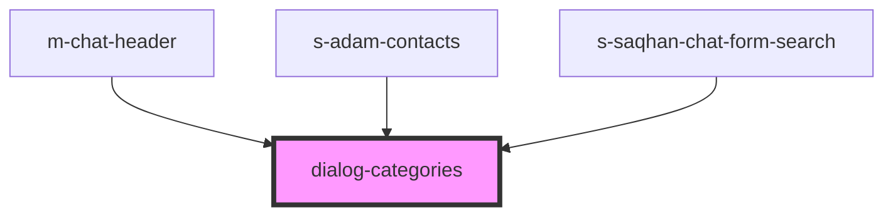

# dialog-categories

<!-- Auto Generated Below -->

## Properties

| Property     | Attribute | Description | Type                             | Default     |
| ------------ | --------- | ----------- | -------------------------------- | ----------- |
| `categories` | --        |             | `ChatCategoryInterface[]`        | `undefined` |
| `theme`      | `theme`   |             | `"comp" \| "mobile" \| "module"` | `"comp"`    |

## Events

| Event             | Description       | Type                                 |
| ----------------- | ----------------- | ------------------------------------ |
| `clickToCategory` | clock on Category | `CustomEvent<ChatCategoryInterface>` |

## Dependencies

### Used by

 - [m-chat-header](../../mobile/mobile-chat/res/view/mobile-dialogs/res/view/m-chat-header)
 - [s-adam-contacts](../../comp/s-adam-contacts)
 - [s-saqhan-chat-form-search](../../module/module-chat/res/view/s-saqhan-chat-wrapper/res/view/s-saqhan-chat-users-wrapper/res/view/s-saqhan-chat-form-search)

### Graph

----------------------------------------------

*Built with [StencilJS](https://stenciljs.com/)*
