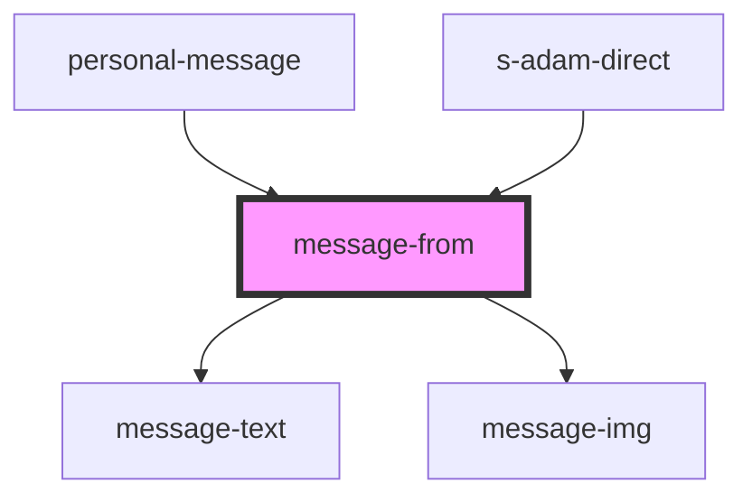

# message-from

<!-- Auto Generated Below -->

## Properties

| Property  | Attribute | Description                          | Type  | Default     |
| --------- | --------- | ------------------------------------ | ----- | ----------- |
| `message` | `message` | Принимаем сообщения для пользователя | `any` | `undefined` |

## Dependencies

### Used by

 - [personal-message](../../../mobile/mobile-chat/res/view/mobile-personal/res/view/personal-message)
 - [s-adam-direct](../../../comp/s-adam-direct)

### Depends on

- [message-text](./res/view/message-text)
- [message-img](./res/view/message-img)

### Graph

----------------------------------------------

*Built with [StencilJS](https://stenciljs.com/)*
