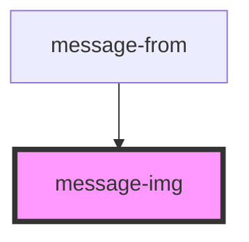

# message-img

<!-- Auto Generated Below -->

## Properties

| Property        | Attribute         | Description                          | Type  | Default     |
| --------------- | ----------------- | ------------------------------------ | ----- | ----------- |
| `checkSendMess` | `check-send-mess` | Проверка статуса доставки сообщения  | `any` | `undefined` |
| `message`       | `message`         | Принимаем сообщения для пользователя | `any` | `undefined` |

## Dependencies

### Used by

 - [message-from](../../..)

### Graph

----------------------------------------------

*Built with [StencilJS](https://stenciljs.com/)*
