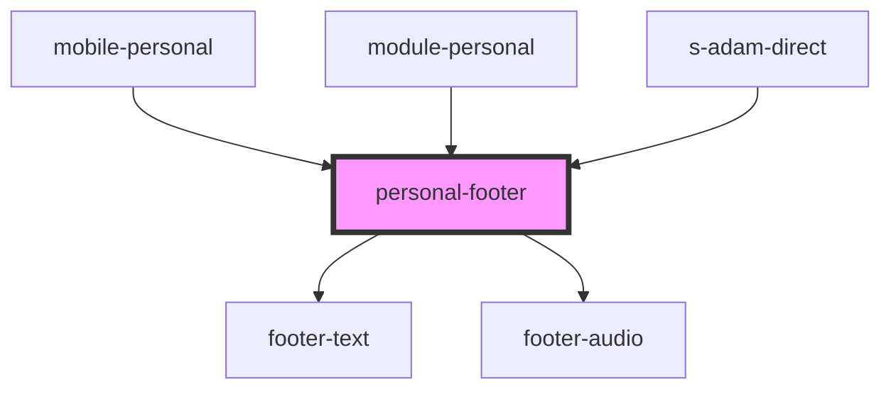

# personal-footer

<!-- Auto Generated Below -->

## Properties

| Property | Attribute | Description | Type                 | Default  |
| -------- | --------- | ----------- | -------------------- | -------- |
| `theme`  | `theme`   |             | `"comp" \| "mobile"` | `"comp"` |

## Events

| Event         | Description       | Type               |
| ------------- | ----------------- | ------------------ |
| `clickToLink` | click on navigate | `CustomEvent<any>` |

## Dependencies

### Used by

 - [mobile-personal](../../mobile/mobile-chat/res/view/mobile-personal)
 - [module-personal](../../module/module-chat/res/view/s-saqhan-chat-wrapper/res/view/module-personal)
 - [s-adam-direct](../../comp/s-adam-direct)

### Depends on

- [footer-text](./res/view/footer-text)
- [footer-audio](./res/view/footer-audio)

### Graph

----------------------------------------------

*Built with [StencilJS](https://stenciljs.com/)*
