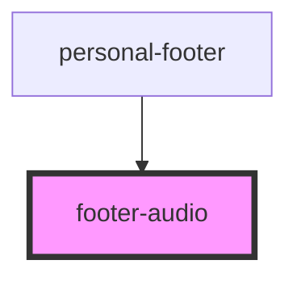

# footer-audio

<!-- Auto Generated Below -->

## Properties

| Property       | Attribute       | Description | Type  | Default     |
| -------------- | --------------- | ----------- | ----- | ----------- |
| `switchFooter` | `switch-footer` |             | `any` | `undefined` |

## Events

| Event            | Description | Type                   |
| ---------------- | ----------- | ---------------------- |
| `clickOnAudio`   |             | `CustomEvent<any>`     |
| `recordFinished` |             | `CustomEvent<boolean>` |

## Dependencies

### Used by

 - [personal-footer](../../..)

### Graph

----------------------------------------------

*Built with [StencilJS](https://stenciljs.com/)*
