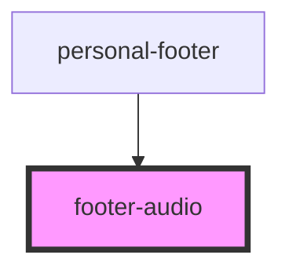

# footer-audio

<!-- Auto Generated Below -->

## Properties

| Property | Attribute | Description         | Type                             | Default  |
| -------- | --------- | ------------------- | -------------------------------- | -------- |
| `theme`  | `theme`   | Пропс с классом CSS | `"comp" \| "mobile" \| "module"` | `"comp"` |

## Events

| Event            | Description                  | Type                   |
| ---------------- | ---------------------------- | ---------------------- |
| `recordFinished` | Эвент окончания записи аудио | `CustomEvent<boolean>` |

## Dependencies

### Used by

 - [personal-footer](../../..)

### Graph

----------------------------------------------

*Built with [StencilJS](https://stenciljs.com/)*
