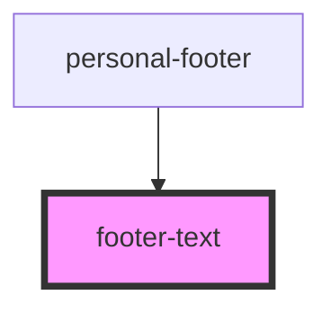

# footer-text

<!-- Auto Generated Below -->

## Properties

| Property         | Attribute          | Description              | Type                             | Default  |
| ---------------- | ------------------ | ------------------------ | -------------------------------- | -------- |
| `canRecordAudio` | `can-record-audio` | Возможность записи аудио | `boolean`                        | `false`  |
| `theme`          | `theme`            | Пропс с классом          | `"comp" \| "mobile" \| "module"` | `"comp"` |

## Events

| Event                   | Description       | Type                  |
| ----------------------- | ----------------- | --------------------- |
| `sendTextMessage`       |                   | `CustomEvent<string>` |
| `showRecordAudioFooter` | Пока футера аудио | `CustomEvent<void>`   |
| `showSendFileFooter`    |                   | `CustomEvent<void>`   |

## Dependencies

### Used by

 - [personal-footer](../../..)

### Graph

----------------------------------------------

*Built with [StencilJS](https://stenciljs.com/)*
