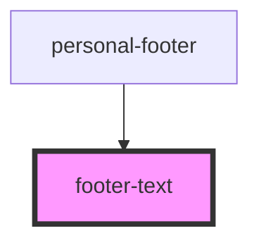

# footer-text

<!-- Auto Generated Below -->

## Events

| Event            | Description | Type               |
| ---------------- | ----------- | ------------------ |
| `clickOnAudio`   |             | `CustomEvent<any>` |
| `clickToLink`    |             | `CustomEvent<any>` |
| `mouseOverInput` |             | `CustomEvent<any>` |

## Dependencies

### Used by

 - [personal-footer](../../..)

### Graph

----------------------------------------------

*Built with [StencilJS](https://stenciljs.com/)*
