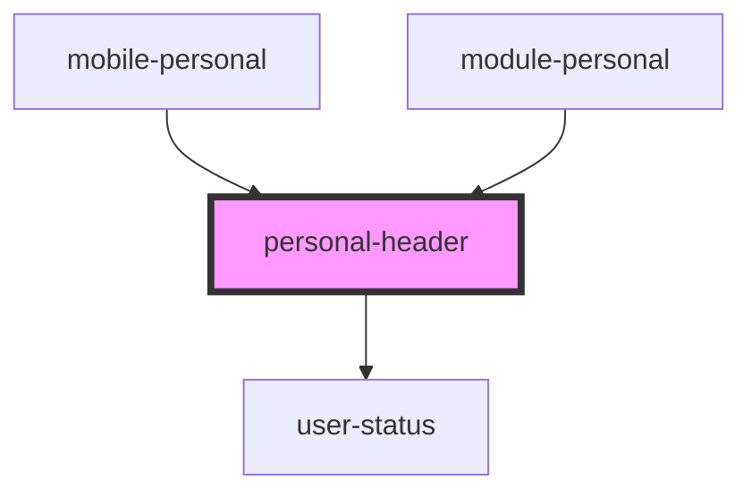

# personal-header

<!-- Auto Generated Below -->

## Properties

| Property            | Attribute             | Description                  | Type                                                                            | Default     |
| ------------------- | --------------------- | ---------------------------- | ------------------------------------------------------------------------------- | ----------- |
| `chatActionState`   | `chat-action-state`   |                              | `ChatUserActionStatusState.audioRecording \| ChatUserActionStatusState.writing` | `undefined` |
| `chatPresenceState` | `chat-presence-state` |                              | `ChatUserPresenceState.offline \| ChatUserPresenceState.online`                 | `undefined` |
| `dialogs`           | --                    | array data dialogs           | `ChatDialogInterface[]`                                                         | `undefined` |
| `message`           | --                    | array data personal messages | `ChatMessage[]`                                                                 | `undefined` |
| `openedDialog`      | --                    |                              | `ChatDialogInterface`                                                           | `undefined` |

## Events

| Event                    | Description                 | Type                               |
| ------------------------ | --------------------------- | ---------------------------------- |
| `cancelSearchPersonal`   | отмена поиска               | `CustomEvent<void>`                |
| `clickToDialog`          | Клик по диалогу             | `CustomEvent<ChatClickToLinkEmit>` |
| `clickToLink`            | clock on navigate           | `CustomEvent<void>`                |
| `clickToShowDialogs`     | click to show user profile  | `CustomEvent<string>`              |
| `clickToUserProfile`     |                             | `CustomEvent<void>`                |
| `searchContact`          |                             | `CustomEvent<any>`                 |
| `searchPersonalMessages` | search for private messages | `CustomEvent<string>`              |

## Dependencies

### Used by

 - [mobile-personal](../../mobile/mobile-chat/res/view/mobile-personal)
 - [module-personal](../../module/module-chat/res/view/cnt-module-chat/res/view/module-personal)

### Depends on

- [user-status](../user-status)

### Graph

----------------------------------------------

*Built with [StencilJS](https://stenciljs.com/)*
