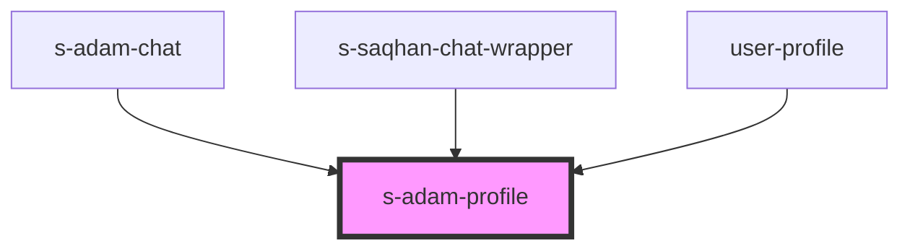

# s-adam-profile

<!-- Auto Generated Below -->

## Properties

| Property | Attribute | Description                          | Type                 | Default  |
| -------- | --------- | ------------------------------------ | -------------------- | -------- |
| `theme`  | `theme`   | Задаем стиль для мобильной/пк версии | `"comp" \| "mobile"` | `"comp"` |

## Events

| Event         | Description | Type               |
| ------------- | ----------- | ------------------ |
| `clickToLink` |             | `CustomEvent<any>` |

## Dependencies

### Used by

 - [s-adam-chat](../../comp/s-adam-chat)
 - [s-saqhan-chat-wrapper](../../module/module-chat/res/view/s-saqhan-chat-app/res/view/s-saqhan-chat-wrapper)
 - [user-profile](../../mobile/mobile-chat/res/view/user-profile)

### Graph

----------------------------------------------

*Built with [StencilJS](https://stenciljs.com/)*
