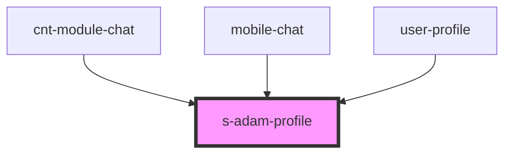

# s-adam-profile

<!-- Auto Generated Below -->

## Properties

| Property     | Attribute | Description                          | Type                             | Default     |
| ------------ | --------- | ------------------------------------ | -------------------------------- | ----------- |
| `categories` | --        | Массив категорий                     | `ChatCategoryInterface[]`        | `undefined` |
| `theme`      | `theme`   | Задаем стиль для мобильной/пк версии | `"comp" \| "mobile" \| "module"` | `"comp"`    |

## Events

| Event                | Description                | Type                |
| -------------------- | -------------------------- | ------------------- |
| `clickToShowDialogs` | Показываем список диалогов | `CustomEvent<void>` |
| `clickToShowFolders` | Показываем папки           | `CustomEvent<void>` |

## Dependencies

### Used by

 - [cnt-module-chat](../../module/module-chat/res/view/cnt-module-chat)
 - [mobile-chat](../../mobile/mobile-chat)
 - [user-profile](../../mobile/mobile-chat/res/view/user-profile)

### Graph

----------------------------------------------

*Built with [StencilJS](https://stenciljs.com/)*
