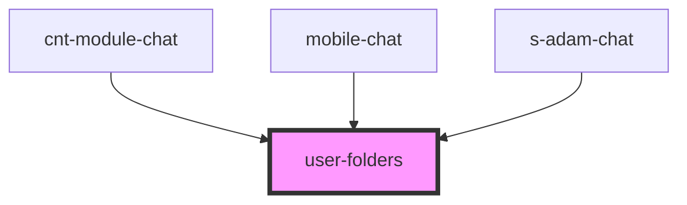

# user-folders

<!-- Auto Generated Below -->

## Properties

| Property  | Attribute | Description                          | Type                             | Default     |
| --------- | --------- | ------------------------------------ | -------------------------------- | ----------- |
| `dialogs` | --        | Массив dialogs                       | `ChatDialogInterface[]`          | `undefined` |
| `theme`   | `theme`   | Задаем стиль для мобильной/пк версии | `"comp" \| "mobile" \| "module"` | `"mobile"`  |

## Events

| Event                | Description                     | Type                                           |
| -------------------- | ------------------------------- | ---------------------------------------------- |
| `clickToUserProfile` | переход на профиль пользователя | `CustomEvent<void>`                            |
| `createFolder`       | создание папки                  | `CustomEvent<ChatCreateFolderOutputInterface>` |

## Dependencies

### Used by

 - [cnt-module-chat](../../module/module-chat/res/view/cnt-module-chat)
 - [mobile-chat](../../mobile/mobile-chat)
 - [s-adam-chat](../../comp/s-adam-chat)

### Graph

----------------------------------------------

*Built with [StencilJS](https://stenciljs.com/)*
