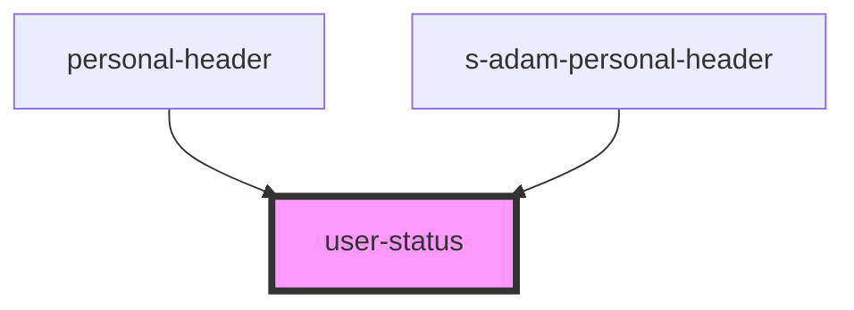

# user-status

<!-- Auto Generated Below -->

## Properties

| Property | Attribute | Description    | Type                             | Default  |
| -------- | --------- | -------------- | -------------------------------- | -------- |
| `theme`  | `theme`   | Тема для блока | `"comp" \| "mobile" \| "module"` | `"comp"` |

## Dependencies

### Used by

 - [personal-header](../personal-header)
 - [s-adam-personal-header](../../comp/s-adam-personal-header)

### Graph

----------------------------------------------

*Built with [StencilJS](https://stenciljs.com/)*
